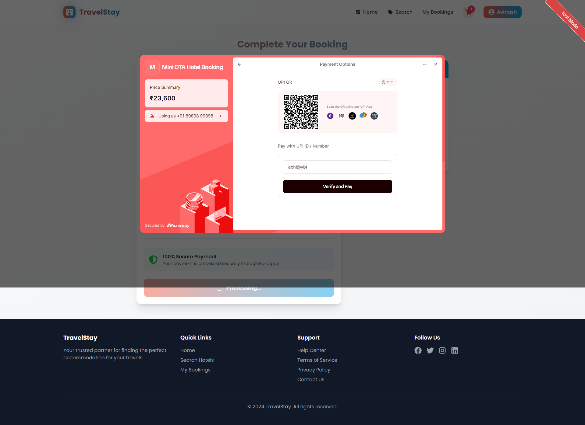

# Hotel Booking System - TravelStay

A modern, full-stack hotel booking platform built with React.js and Node.js, featuring real-time availability, secure payments, and a seamless booking experience.

## 🚀 Features

### Frontend Features

#### 🏠 Homepage & Discovery
- **Hero Section** with animated gradient backgrounds and floating elements
- **Smart Search** functionality with destination, date picker, and guest selection
- **Featured Hotels** carousel showcasing top-rated properties
- **Popular Destinations** grid with visual overlays
- **Statistics Display** showing 2M+ happy guests, 50K+ hotels, 4.8★ rating

#### 🔍 Hotel Search & Filtering
- **Advanced Search** with multiple filters:
  - Destination/city search
  - Check-in/Check-out date selection
  - Guest count configuration
  - Price range filtering
  - Sort by rating, price (low to high), and name
- **Real-time Results** with pagination
- **Hotel Cards** displaying:
  - High-quality images
  - Ratings and reviews
  - Amenity icons (WiFi, Parking, Pool, Restaurant)
  - Price per night
  - Quick view on hover

#### 🏨 Hotel Details
- **Image Gallery** with multiple hotel photos
- **Room Types** with availability status
- **Detailed Information**:
  - Complete amenities list
  - Location with map integration potential
  - Guest reviews and ratings
  - Cancellation policy
- **Room Selection** with capacity and pricing
- **Add to Cart** functionality

#### 🛒 Shopping Cart
- **Multi-hotel Cart** supporting bookings from different properties
- **Item Management**:
  - Update quantities
  - Remove items
  - View booking details
- **Price Breakdown**:
  - Subtotal calculation
  - GST (18%) automatic calculation
  - Total amount display
- **Persistent Cart** using MongoDB

#### 💳 Checkout & Payment
- **Customer Information** form with validation
- **Booking Summary** with all selected items
- **Special Requests** text area
- **Secure Payment** via Razorpay integration:
  - Multiple payment methods
  - Real-time payment verification
  - Payment status tracking
- **GST Invoice** generation

#### 👤 User Account
- **Authentication**:
  - JWT-based secure login
  - User registration with validation
  - Protected routes
  - Session management
- **User Profile**:
  - View and edit personal information
  - Change password functionality
  - Booking history
- **Booking Management**:
  - View all bookings
  - Filter by status (pending, confirmed, cancelled)
  - Booking details with hotel information
  - Cancel bookings

#### 🎨 UI/UX Features
- **Responsive Design** for all screen sizes
- **Modern Glass-morphism** effects
- **Smooth Animations** using CSS transitions
- **Loading States** and skeletons
- **Error Handling** with user-friendly messages
- **Toast Notifications** for actions
- **Date Pickers** with calendar interface
- **Interactive Cards** with hover effects

### Backend Features

#### 🔐 Authentication & Security
- **JWT Authentication** with secure token management
- **Password Hashing** using bcrypt
- **Rate Limiting** to prevent abuse (100 requests per 15 minutes)
- **Helmet.js** for security headers
- **CORS Configuration** with whitelisted origins
- **Input Validation** using express-validator

#### 📊 Database Architecture
- **Dual Database System**:
  - **MongoDB** for flexible hotel data, user profiles, and cart management
  - **PostgreSQL** (via Sequelize) for transactional booking and payment data
- **Data Models**:
  - Users (MongoDB)
  - Hotels with rooms and amenities (MongoDB)
  - Bookings with transactions (PostgreSQL)
  - Payments with Razorpay integration (PostgreSQL)
  - Cart for temporary bookings (MongoDB)

#### 🏨 Hotel Management
- **Hotel Operations**:
  - List hotels with pagination
  - Filter by destination, price range, and availability
  - Sort by rating, price, or name
  - Featured hotels endpoint
  - Detailed hotel information
- **Room Management**:
  - Multiple room types per hotel
  - Real-time availability tracking
  - Capacity management
  - Dynamic pricing support

#### 📅 Booking System
- **Booking Creation**:
  - Multi-room booking support
  - Guest count validation
  - Special requests handling
  - Automatic reference number generation
- **Booking Management**:
  - View bookings with pagination
  - Filter by status
  - Update booking status
  - Cancel bookings with room restoration
- **Transaction Management**:
  - ACID compliance using PostgreSQL transactions
  - Automatic rollback on failures

#### 💰 Payment Processing
- **Razorpay Integration**:
  - Secure payment order creation
  - Signature verification
  - Payment status tracking
  - Refund processing
- **Multi-booking Checkout**:
  - Process multiple bookings in one transaction
  - GST calculation (18%)
  - Discount and promo code support
  - Payment record creation

#### 🛒 Cart System
- **Cart Features**:
  - Add/remove items
  - Update quantities
  - Calculate totals
  - Clear cart after checkout
- **Session Persistence** using MongoDB

#### 📈 Additional Features
- **Statistics API** for dashboard metrics
- **Health Check** endpoint for monitoring
- **Error Handling** with centralized middleware
- **Logging** with Morgan in development
- **Environment Configuration** with dotenv

## 📸 Screenshots & User Interface

### 1. Homepage - Hero Section

The landing page features a stunning gradient hero section with:
- Animated background with floating elements
- Statistics display (2M+ happy guests, 50K+ hotels, 4.8★ rating)
- Smart search bar with destination, check-in/out dates, and guest selection
- "Why Choose TravelStay" section with key features
- Popular destinations showcase with image overlays
- Call-to-action section for starting the journey

### 2. User Login Page

Clean and modern login interface featuring:
- Email and password input fields
- "Remember me" checkbox and "Forgot password" link
- Social login options (Google and Facebook)
- Sign-up redirect for new users
- Security badges displaying 100% secure, 24/7 support, and easy booking
- Gradient background maintaining brand consistency

### 3. User Registration Page

Comprehensive registration form with:
- Personal information fields (first name, last name, email)
- Phone number with country code
- Secure password creation with visibility toggle
- Terms and conditions acceptance
- Privacy policy agreement checkbox
- Social sign-up alternatives
- Platform benefits display on the right side

### 4. Hotel Search Results

Advanced search results page showing:
- Destination-based search with date and guest filters
- Hotel cards with images, ratings, and amenities
- Price per night display (₹4000 - ₹18000 range)
- "View Details" buttons for each property
- Filter options in sidebar (price range, rating, etc.)
- Sort functionality
- Hotels like The Taj Mahal Palace, The St. Regis Mumbai, and JW Marriott Juhu

### 5. Hotel Detail Page

Comprehensive hotel information including:
- Large hero image of the property
- Star rating and guest reviews
- Detailed amenities list (WiFi, Spa, Gym, Pool, etc.)
- Room selection with different categories
- Price breakdown per room type
- "Book Your Stay" section with date selection
- Booking summary with total price calculation
- Hotel policies and cancellation information

### 6. Shopping Cart

User-friendly cart interface featuring:
- Selected hotel and room details
- Check-in/out dates display
- Number of nights and guests
- Room charges breakdown
- GST (18%) calculation
- Total amount with taxes (₹23,600)
- Promo code application field
- "Proceed to Checkout" button
- Booking benefits listing

### 7. Checkout - Guest Information

Detailed checkout form with:
- Guest information fields (name, email, phone)
- Billing address section
- Country/state selection
- ZIP code entry
- Special requests text area
- Order summary sidebar showing subtotal and taxes
- Total amount display (₹23,600)
- Secure payment assurance via Razorpay

### 8. Payment Gateway - Razorpay Integration

Secure payment interface offering:
- Multiple payment methods (UPI, Cards, Netbanking, Wallet)
- QR code for UPI payments
- Recommended payment options
- Price summary display
- Secure transaction powered by Razorpay
- Quick payment options for major banks
- Mobile number verification for UPI

### 9. UPI Payment Screen

UPI payment verification showing:
- UPI ID entry field
- QR code scanning option
- Connected payment apps display
- Amount confirmation
- "Verify and Pay" button
- Security badges
- Alternative payment method links

### 10. Payment Success Confirmation

Booking confirmation screen displaying:
- Success checkmark animation
- Booking details summary
- Payment confirmation with amount
- Transaction date and time
- UPI transaction ID
- Razorpay reference for support
- Auto-redirect notification

### 11. My Bookings Dashboard

Comprehensive booking management with:
- List view of all bookings
- Status indicators (Confirmed, Pending, Cancelled)
- Hotel thumbnails and names
- Check-in/out dates for each booking
- Room and guest information
- Price display per booking
- Action buttons (View Details, Cancel, Rebook)
- Filter and sort options at the top
- Mobile app promotion banner

### 12. Booking Detail View

Detailed booking information showing:
- Booking ID and confirmation status
- Payment status (Paid)
- Hotel information with rating
- Complete address and contact details
- Amenities available
- Check-in/out dates and times
- Room type and guest count
- Price breakdown with GST
- Important information and policies
- Cancel booking option
- "Book Another Hotel" CTA
- Customer support contact

## 🛠️ Technology Stack

### Frontend
- **React.js** - UI framework
- **Redux Toolkit** - State management
- **React Router v6** - Navigation
- **Tailwind CSS** - Styling
- **React Icons** - Icon library
- **React Datepicker** - Date selection
- **Axios** - HTTP client
- **Vite** - Build tool

### Backend
- **Node.js** - Runtime environment
- **Express.js** - Web framework
- **MongoDB** - NoSQL database
- **PostgreSQL** - Relational database
- **Mongoose** - MongoDB ODM
- **Sequelize** - PostgreSQL ORM
- **Razorpay** - Payment gateway
- **JWT** - Authentication
- **Bcrypt.js** - Password hashing

### DevOps & Tools
- **Vercel** - Deployment platform
- **Aiven** - Database hosting
- **Git** - Version control
- **ESLint** - Code linting
- **Nodemon** - Development server

## 📦 Installation

### Prerequisites
- Node.js (v14 or higher)
- MongoDB (local or cloud instance)
- PostgreSQL (local or cloud instance)
- Razorpay account for payments

### Backend Setup

1. Clone the repository:
```bash
git clone https://github.com/yourusername/hotel-booking-system.git
cd hotel-booking-system
```

2. Install backend dependencies:
```bash
cd backend
npm install
```

3. Create `.env` file in backend directory:
```env
PORT=5000
NODE_ENV=development

# MongoDB
MONGODB_URI=your_mongodb_connection_string

# PostgreSQL
DATABASE_URL=your_postgresql_connection_string
DB_NAME=hotel_booking
DB_USER=your_db_user
DB_PASSWORD=your_db_password
DB_HOST=your_db_host
DB_PORT=5432

# JWT
JWT_SECRET=your_jwt_secret_key

# Razorpay
RAZORPAY_KEY_ID=your_razorpay_key_id
RAZORPAY_KEY_SECRET=your_razorpay_key_secret

# Client
CLIENT_URL=http://localhost:5173
```

4. Run backend server:
```bash
npm run dev
```

### Frontend Setup

1. Install frontend dependencies:
```bash
cd ../frontend
npm install
```

2. Create `.env` file in frontend directory:
```env
VITE_API_URL=http://localhost:5000/api
VITE_RAZORPAY_KEY_ID=your_razorpay_key_id
```

3. Run frontend development server:
```bash
npm run dev
```

## 🚀 Deployment

### Vercel Deployment

1. Install Vercel CLI:
```bash
npm i -g vercel
```

2. Deploy backend:
```bash
cd backend
vercel --prod
```

3. Deploy frontend:
```bash
cd frontend
vercel --prod
```

## 📝 API Documentation

### Authentication Endpoints
- `POST /api/auth/register` - User registration
- `POST /api/auth/login` - User login
- `GET /api/auth/profile` - Get user profile
- `PUT /api/auth/profile` - Update profile

### Hotel Endpoints
- `GET /api/hotels` - List hotels with filters
- `GET /api/hotels/:id` - Get hotel details
- `GET /api/hotels/featured` - Get featured hotels
- `POST /api/hotels/search` - Advanced search

### Booking Endpoints
- `POST /api/bookings` - Create booking
- `GET /api/bookings` - Get user bookings
- `GET /api/bookings/:id` - Get booking details
- `PUT /api/bookings/:id/status` - Update booking
- `DELETE /api/bookings/:id` - Cancel booking

### Cart Endpoints
- `GET /api/cart` - Get cart items
- `POST /api/cart` - Add to cart
- `PUT /api/cart/:itemId` - Update cart item
- `DELETE /api/cart/:itemId` - Remove from cart

### Payment Endpoints
- `POST /api/payment/checkout` - Process checkout
- `POST /api/payment/verify` - Verify payment
- `GET /api/payment/:id` - Get payment details
- `POST /api/payment/refund` - Process refund

## 🔒 Security Features

- **Input Validation** on all endpoints
- **SQL Injection Prevention** via parameterized queries
- **XSS Protection** through Helmet.js
- **Rate Limiting** to prevent DoS attacks
- **Secure Password Storage** with bcrypt
- **JWT Token Expiration** and refresh
- **HTTPS Only** cookies in production
- **Environment Variables** for sensitive data

## 🧪 Testing

Run tests (if implemented):
```bash
npm test
```

## 📊 Performance Optimizations

- **Database Indexing** for faster queries
- **Pagination** on all list endpoints
- **Caching** strategy for static data
- **Image Optimization** with lazy loading
- **Code Splitting** in React
- **Gzip Compression** on server

## 🤝 Contributing

1. Fork the repository
2. Create your feature branch (`git checkout -b feature/AmazingFeature`)
3. Commit your changes (`git commit -m 'Add some AmazingFeature'`)
4. Push to the branch (`git push origin feature/AmazingFeature`)
5. Open a Pull Request

## 📄 License

This project is licensed under the MIT License - see the LICENSE file for details.

## 👥 Authors

- **Your Name** - Initial work

## 🙏 Acknowledgments

- React.js community
- Node.js contributors
- Razorpay for payment processing
- All open-source library maintainers

## 📞 Support

For support, email support@travelstay.com or open an issue in the GitHub repository.

---

**Built with ❤️ by the TravelStay Team**